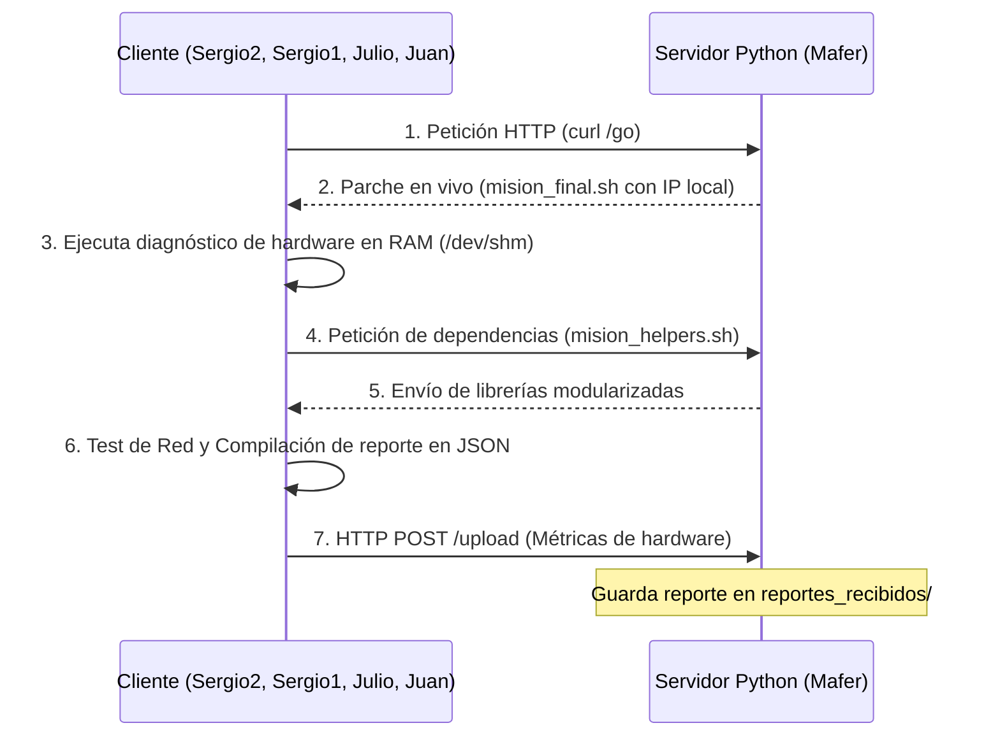

# 🚀 Proyecto Misión Artemis: Ground Control y Telemetría en Red

## Ecosistema Cliente-Servidor Interactivo en Red Local mediante Bash y Python 3

[](https://ubuntu.com/)
[](https://www.gnu.org/software/bash/)
[](https://www.python.org/)
[](https://git-scm.com/)
[](https://github.com/)

---

## 🌌 Descripción del Proyecto

La **Misión Artemis** es un ecosistema cliente-servidor dinámico, robusto e interactivo desarrollado en el marco de la administración de sistemas Linux, programación en consola (*scripting*), redes de telecomunicaciones local/puente y control de versiones distribuido.

El sistema simula un entorno espacial de telemetría y comunicación bidireccional entre las estaciones de los soldados (**Clientes Bash**) y la base de lanzamiento central (**Servidor Python** o "Ground Control").

---

## 🎖️ Estructura del Escuadrón Artemis

Vuestra tripulación de ingeniería de sistemas se encuentra organizada bajo una estructura ágil y profesional de colaboración:

```
🚀 [ COMANDANTE LÍDER DE INTEGRACIÓN ]
               Mafer
                 │
                 ▼
     [ SOLDADOS ESPECIALISTAS ]
┌──────────┬──────────┬─────────┬──────────┐
│          │          │         │          │
Sergio1   Julio      Juan     sergio2
```

### 🛰️ Canales de Red y Control de Versiones:
* **Nave Nodriza (Fork de Grupo):** [mfcruzm-arch/IFCD00112-SERGIO-2-JULIO-JUAN-Y-MAFER](https://github.com/mfcruzm-arch/IFCD00112-SERGIO-2-JULIO-JUAN-Y-MAFER)
* **Base de Lanzamiento (Profesor Upstream):** [TodoEconometria/ifcd0112_launch-control_Repo](https://github.com/TodoEconometria/ifcd0112_launch-control_Repo)

---

## 📂 Mapa y Estructura del Proyecto

```
IFCD0112/
├── 01_Modulo_1_Fundamentos/
│   └── Semana_07_08/
│       ├── README.md                          <-- (Este archivo) Portada oficial para GitHub
│       ├── MANUAL_TECNICO_INTEGRACION_RED.md  <-- Manual de 57 KB de redes, SSH, tokens y solución de errores
│       └── mision_artemis/                    <-- Directorio unificado del proyecto
│           ├── README.md                      <-- Portada espejo del proyecto
│           ├── MANUAL_TECNICO_INTEGRACION_RED.md <-- Manual técnico del proyecto
│           ├── servidor.py                    <-- Servidor dinámico central de Ground Control (Puerto 8000)
│           ├── mision_final.sh                <-- Script cliente orquestador final (Nivel 5)
│           ├── mision_helpers.sh              <-- Biblioteca modular de funciones de verificación de red
│           ├── nivel1_saludo.sh               <-- Nivel 1: Saludo interactivo con colores ANSI y ASCII Art
│           ├── nivel2_diagnostico.sh          <-- Nivel 2: Diagnóstico de hardware con spinners cinéticos (\r)
│           ├── nivel3_quiz.sh                 <-- Nivel 3: Juego interactivo de preguntas y arrays de Bash
│           └── nivel4_cliente.sh              <-- Nivel 4: Script con almacenamiento volátil en RAM (/dev/shm)
```

---

## 🛠️ Flujo Operativo y Ejecución en Red

El sistema opera mediante una conexión en caliente donde el cliente interactivo se descarga directamente a la memoria RAM de los soldados, ejecuta el diagnóstico y envía de vuelta los datos.



### 📡 1. Levantar la Estación Central (Mafer - Servidor)
Entra en la carpeta del proyecto en la VM de Mafer y levanta el servidor sockets:
```bash
python3 servidor.py
```
*El servidor se quedará a la escucha en el puerto **`8000`**, listo para inyectar parches a las IPs de los soldados de la subred del aula.*

### 🚀 2. Ejecutar la Misión (Soldados - Clientes)
Cualquier soldado del escuadrón (Sergio2, Sergio1, Julio o Juan) puede ejecutar el cliente directamente en su VM apuntando a la IP de Mafer:
```bash
bash <(curl -s http://IP_DE_MAFER:8000/go)
```

#### 🔄 ¿Cómo funciona el encadenamiento secuencial?
El script orquestador central `mision_final.sh` descarga y ejecuta cada nivel consecutivamente empleando el comando **`source`** de Bash:
1. **Nivel 1 (Saludo):** Inicializa la sesión y recoge el nombre del soldado.
2. **Nivel 2 (Diagnóstico):** Ejecuta la telemetría en segundo plano y recopila las métricas del sistema.
3. **Nivel 3 (Quiz):** Realiza un cuestionario interactivo de redes y acumula la puntuación en memoria.
4. **Nivel 4 (Cliente):** Reúne todos los datos de las fases anteriores (usuario, telemetría y puntuación) y envía un único reporte JSON consolidado a la base de datos de Mafer.

*Nota: Al usar `source` en lugar de llamar a procesos aislados con `bash`, todas las variables persisten en memoria a través de los 4 niveles de forma limpia y transparente.*

---

## 🪖 Manual de Campaña para Contribuciones (Git Workflow)

Para añadir tus avances al repositorio grupal de Mafer de manera segura y sin generar conflictos de fusión, sigue este flujo estándar:

### 1. Activar el almacenamiento permanente de credenciales (OBLIGATORIO)
Ejecuta esto para no tener que volver a escribir tu Token de GitHub nunca más:
```bash
git config --global credential.helper store
```

### 2. Clonar el Repositorio de la Comandante
```bash
cd ~/sync-curso/
git clone https://github.com/mfcruzm-arch/IFCD00112-SERGIO-2-JULIO-JUAN-Y-MAFER.git
cd IFCD00112-SERGIO-2-JULIO-JUAN-Y-MAFER
```
*(Al pedirte credenciales, introduce tu usuario de GitHub y tu Token personal PAT como contraseña).*

### 3. Sincronizar y Crear tu Rama Personal (Ejemplo para Sergio2)
```bash
# Descarga las ramas oficiales de Mafer
git fetch origin
git checkout mision-artemis

# Abre tu rama táctica personal
git checkout -b feat-sergio2
```

### 4. Guardar tus avances y subirlos a GitHub
Una vez que edites el código y verifiques que todo compila:
```bash
git add .
git commit -m "feat: aportaciones y optimizaciones de red de Sergio2"
git push origin feat-sergio2
```
*(Informa a la comandante Mafer para que apruebe tu Pull Request en la web).*

---

## 🛡️ Lecciones Técnicas Destacadas

* **stdin en Tuberías:** Uso de la sustitución de procesos `bash <(curl ...)` en lugar de `curl | bash` para permitir la captura interactiva de teclado de los soldados en el cuestionario.
* **Almacenamiento Volátil:** Uso de `/dev/shm` (memoria RAM) para ejecutar el cliente, previniendo el desgaste físico de las unidades de almacenamiento local y asegurando un rastro limpio al apagar la VM.
* **Seguimiento Cinético de Procesos:** Diseño de bucles de spinners dinámicos que monitorizan procesos asíncronos mediante `kill -0 $pid`.
* **Filtros .gitignore Profesionales:** Exclusión estricta de variables de entorno confidenciales (`.env`), carpetas de caché precompilada (`__pycache__`) y reportes locales de telemetría.

---

## 📖 Referencias y Atribuciones

* **Curso Spring Boot & Hibernate - TodoEconometria:** Guía rápida de Git/GitHub, configuración de remotos Upstream y buenas prácticas de .gitignore. [TodoEconometria URL](https://todoeconometria.github.io/curso-spring-hibernate/git-github/).
* **Sistemas Operativos e Infraestructura de Red - IFCD0112:** Reto Misión Artemis y Ground Control.
* **Google Antigravity AI (DeepMind Team):** Copiloto cognitivo para el desarrollo, depuración y maquetación de la documentación técnica.

---
*Misión Artemis — Desarrollado en cooperación ágil para la excelencia técnica de sistemas. Licencia educativa.*
