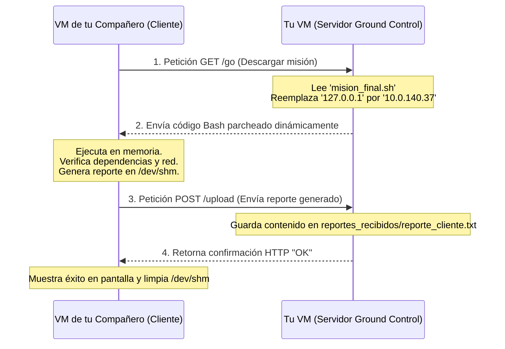

# Manual de Ingeniería de Sistemas: Redes, Automatización y Git en la "Misión Artemis"
## Guía Completa de Configuración de Adaptadores, Servidores de Datos Python, Clientes de Red Bash y Gestión de Versiones con Git

> **Curso:** IFCD0112 — Programación con Lenguajes Orientados a Objetos y Bases de Datos Relacionales (SEPE)  
> **Centro:** Centro de Tecnologías de la Información San Blas / TodoEconometria  
> **Área:** Infraestructura, Redes, Scripting e Control de Versiones  
> **Manual de Referencia:** Basado en el Reto Artemis y en las instrucciones del curso.

---

## Introducción al Manual

Este manual ha sido diseñado bajo un enfoque estrictamente **didáctico y secuencial**. No daremos por sentado ningún conocimiento básico de redes, scripting o control de versiones. Explicaremos el "por qué" de cada comando y cada botón para que no solo sepas ejecutar el reto, sino que **comprendas la ingeniería que hay detrás**.

A lo largo del documento aprenderás a configurar tu red en modo puente, obtener una IP dinámica, escribir y servir código en red, colaborar con tus compañeros de clase y finalmente registrar todo tu trabajo en Git mediante flujos de desarrollo profesionales.

---

## SECCIÓN 1: Preparación del Entorno de Red (Adaptador Puente + DHCP)

Para que tu máquina virtual pueda "hablar" con los servidores del aula y las máquinas de tus compañeros, necesitamos que se comporte como un ordenador real conectado físicamente a la red de clase.

```
       [ RED LOCAL DEL AULA (Subred 10.0.140.0/24) ]
                             │
     ┌───────────────────────┴───────────────────────┐
     ▼                                               ▼
[ Tu PC Windows ]                           [ PC de tu Compañero ]
     │ (Tarjeta real)                            │ (Tarjeta real)
     ▼                                           ▼
[ Adaptador Puente ]                        [ Adaptador Puente ]
     │ (Habilitado como Adpt. 3)                 │ (Habilitado como Adpt. 3)
     ▼                                           ▼
[ Tu VM Ubuntu (enp0s9) ]                   [ VM de tu Compañero ]
  IP: 10.0.140.X                              IP: 10.0.140.Y
```

### 1.1 ¿Qué es un Adaptador Puente (Bridge Mode)?
* **NAT (Modo por defecto de VirtualBox):** Tu máquina virtual se esconde detrás de tu PC Windows. Puede salir a Internet, pero nadie desde fuera (ni tus compañeros ni el profesor) puede iniciar una conexión directa hacia ella.
* **Adaptador Puente (Bridge):** VirtualBox "tiende un puente virtual" directo a tu tarjeta de red física (cable Ethernet o chip WiFi). Tu máquina virtual de Ubuntu se conecta de forma directa a la red del aula, solicitando su propia dirección IP directamente al router o servidor del aula, comportándose como si fuese un PC físico independiente.

### 1.2 Configuración del Adaptador 3 Paso a Paso (VirtualBox)
Para configurar la tarjeta puente, **tu Máquina Virtual debe estar completamente apagada** (`sudo poweroff`):

1. En la ventana principal de VirtualBox, haz clic en tu máquina virtual y presiona el botón **Configuración** (rueda dentada).
2. Ve a la pestaña **Red** en el menú de la izquierda.
3. Selecciona la pestaña superior que dice **Adaptador 3**.
4. Marca la casilla **Habilitar adaptador de red**.
5. En el menú desplegable **Conectado a:** selecciona **Adaptador puente**.
6. En el menú desplegable **Nombre:** selecciona el chip físico real de tu PC Windows:
   * Si estás conectado por **cable físico**, busca el que empiece por *Realtek PCIe...* o *Intel Ethernet...*.
   * Si estás conectado por **WiFi**, busca el que empiece por *Intel Wireless...*, *Atheros...* o *Broadcom...*.
   * **REGLA DE ORO:** Nunca selecciones *VirtualBox Host-Only*, ya que eso crearía una red interna privada cerrada solo a tu PC Windows actual.
7. Despliega la pestaña inferior que dice **Avanzadas**.
8. En **Modo promiscuo:** selecciona **Permitir todo** (esto es crucial para que la tarjeta de red pueda recibir paquetes de red que no vayan dirigidos estrictamente a ella).
9. Haz clic en **Aceptar** y enciende tu máquina virtual.

### 1.3 Obtención de IP Automática mediante DHCP

Al arrancar tu máquina Ubuntu, un demonio (programa de fondo) intentará comunicarse con el servidor DHCP del aula para pedir una dirección IP de forma automática para tu nueva interfaz de red (que en Ubuntu se llamará `enp0s9`).

#### ¿Qué es DHCP?
El *Dynamic Host Configuration Protocol* (Protocolo de Configuración Dinámica de Hosts) es un sistema en red donde un servidor central asigna automáticamente direcciones IP, máscaras de subred y rutas por defecto a cualquier equipo que se conecte a la red, evitando que los usuarios tengan que configurar sus parámetros a mano y previniendo colisiones de IP idénticas.

#### Comprobación de la IP obtenida:
Abre tu terminal en Ubuntu y ejecuta:
```bash
ip -4 addr show enp0s9
```
*(El parámetro `-4` filtra para mostrar únicamente direcciones IPv4, que son las de formato numérico estándar `X.X.X.X`).*

Deberías ver una línea que empiece por `inet 10.0.140.XX/24`. Si aparece, ¡enhorabuena, tu tarjeta puente está operativa!

#### ¿Qué hacer si no obtienes IP (o sale una IP que empieza por `169.254.X.X`)?
Las IPs `169.254.X.X` se conocen como direcciones **APIPA** (direcciones privadas automáticas de enlace local) y significan que tu sistema se rindió tras no conseguir respuesta de ningún servidor DHCP.

Para forzar al cliente DHCP de tu sistema a refrescar e intentar obtener una IP válida del aula, ejecuta estas líneas en orden:

```bash
# 1. Libera la IP que tenga asignada actualmente (si la hay)
sudo dhclient -r enp0s9

# 2. Solicita una nueva IP fresca al servidor DHCP del aula
sudo dhclient enp0s9

# 3. Vuelve a comprobar la interfaz de red
ip -4 addr show enp0s9
```

### 1.4 Verificación final de Conectividad (`ping`)
Una vez confirmada tu IP en el rango `10.0.140.X`, comprueba que tu tarjeta de red puede "tocar" al servidor central (Ground Control) enviando pequeños paquetes de prueba:

```bash
ping -c 3 10.0.140.2
```
* **`-c 3`:** Significa "count 3" e indica que solo envíe 3 paquetes de prueba y se detenga automáticamente.
* Si el resultado final muestra `0% packet loss` (0% de paquetes perdidos), tu canal de red está listo para el despegue.

---

## SECCIÓN 2: Creación de los Scripts y Despliegue del Servidor de Datos en Python

En lugar de limitarte a ejecutar scripts externos, vas a convertir tu máquina virtual en un **servidor de código** para que tus compañeros puedan descargar tus scripts interactivos directamente a sus terminales.

### 2.1 Preparación de la Carpeta de Servidor y los Scripts
Para mantener tu sistema limpio e integrado en vuestro repositorio de Git, utilizaremos directamente la carpeta oficial del proyecto. Abre la terminal de Ubuntu y accede a ella:

```bash
# Navega directamente a la carpeta de tu proyecto de GitHub
cd /home/ubuntu/sync-curso/IFCD0112/01_Modulo_1_Fundamentos/Semana_07_08/Proy_1_Los_Pegaos/
```

Crea dentro de esa carpeta un script básico de prueba. Utilizaremos el comando `cat` para escribirlo directamente en un archivo llamado `prueba_conexion.sh`:

```bash
cat << 'EOF' > prueba_conexion.sh
#!/bin/bash
clear
echo -e "\033[1;32m=== CONEXIÓN ESTABLECIDA ===\033[0m"
echo "Hola, estás ejecutando código alojado en el PC de tu compañero de red."
echo "¡Felicidades, la red funciona perfectamente!"
EOF
```

### 2.2 Método A: Levantar un Servidor Estático de Archivos (Puerto 8000)
Es la opción idónea cuando únicamente quieres compartir archivos estáticos listos para descargar (como scripts individuales) en un puerto rápido como el `8000`.

Asegúrate de estar dentro de la carpeta del proyecto `/home/ubuntu/sync-curso/IFCD0112/01_Modulo_1_Fundamentos/Semana_07_08/Proy_1_Los_Pegaos/` y ejecuta:
```bash
python3 -m http.server 8000
```

#### ¿Qué significa cada término de esta instrucción?
* **`python3`:** Invoca al intérprete de Python versión 3 instalado en tu máquina.
* **`-m http.server`:** Le indica a Python que ejecute como un programa el módulo interno `http.server`. Su función por### 2.3 Método B: Desplegar tu propio Servidor "Ground Control" Dinámico (Puerto 8000)
Si en lugar de compartir archivos estáticos quieres simular de forma exacta el servidor del profesor (`10.0.140.2`), debes desplegar un servidor HTTP dinámico personalizado que pueda:
1. **Entregar dinámicamente tu script principal** (`mision_final.sh`) cuando un compañero solicite `GET /go`.
2. **Auto-parchear la dirección IP** en el script devuelto en tiempo real para que el cliente apunte de vuelta a tu servidor automáticamente.
3. **Recibir y almacenar reportes de telemetría** mediante solicitudes `POST /upload`.

Este servidor ya está programado en tu repositorio en el archivo `servidor.py`. Para levantarlo en tu puerto `8000`, sitúate en la carpeta del proyecto y ejecuta:
```bash
# 1. Entra en el directorio del proyecto
cd /home/ubuntu/sync-curso/IFCD0112/01_Modulo_1_Fundamentos/Semana_07_08/Proy_1_Los_Pegaos/

# 2. Lanza el script del servidor dinámico
python3 servidor.py
```

#### 🛠️ ¿Cómo funciona por dentro este servidor dinámico?
El script `servidor.py` sobrescribe los métodos de atención HTTP GET y POST para crear flujos dinámicos:

* **Mapeo de `GET /go` (Envío del Cliente):**
  Cuando detecta que un cliente solicita `/go`, abre tu script `mision_final.sh` en memoria, localiza la línea que dice `SERVER_IP="127.0.0.1"` y la sustituye dinámicamente por la IP física del servidor que ha recibido la petición en la cabecera `Host`. Esto permite que tus compañeros no tengan que editar tu IP a mano; el script autodetectará dónde reportar.
* **Mapeo de `POST /upload` (Base de Datos):**
  Cuando un cliente realiza un envío de telemetría a `/upload`, el servidor extrae el cuerpo del mensaje (el reporte en RAM), crea una carpeta local llamada `reportes_recibidos/` y guarda la información en un archivo con el formato `reporte_<IP_DEL_COMPAÑERO>.txt`.

---

## SECCIÓN 3: Conexión y Colaboración entre Compañeros de Red

Una vez que tu propio servidor dinámico está activo en tu máquina virtual (mostrando la línea `SISTEMA DINÁMICO GROUND CONTROL ACTIVO`), tus compañeros ya pueden conectarse a tu IP para interactuar.

### 3.1 Paso 1: Averiguar tu IP (Bridge o Host-Only)
Abre un terminal secundario y consulta la IP asignada a tu tarjeta enp0s9:
```bash
ip -4 addr show enp0s9
```
* Si estás en **Modo Puente (Bridge)** en clase, verás tu IP de red asignada: `10.0.140.37`.
* Dile a tu compañero: *"Lanza el reto apuntando a mi IP: `10.0.140.37`"*.

### 3.2 Paso 2: Ejecución remota desde la máquina de tu compañero
Tu compañero, desde su propio Ubuntu, lanzará la descarga del script interactivo. Gracias a tu servidor dinámico, este se descargará, se autoconfigurará y reportará de vuelta de forma transparente:

```bash
bash <(curl -s http://10.0.140.37:8000/go)
```
*(Sustituyendo `10.0.140.37` por tu IP real apuntada en el paso anterior).*

#### 🔄 El Ciclo Completo de Colaboración Dinámica en Red


Al terminar la transmisión, verás en tu terminal del servidor cómo se imprimen los registros de descarga y recepción de telemetría con éxito. ¡Has construido tu propia réplica del proyecto del profesor!

### 3.3 Explicación Comando a Comando del Flujo de Telemetría

Para comprender con total rigor académico qué ocurre bajo el capó durante esta secuencia asíncrona de red, desglosamos el ciclo completo de comunicación comando a comando:

#### 1. Fase 1: El Lanzamiento de la Petición (`GET /go`)
* **Acción en el Cliente (Sergio2 - `10.0.140.37`):**
  Envías una solicitud de descarga interactiva a la estación de Mafer:
  ```bash
  bash <(curl -s http://10.0.140.34:8000/go)
  ```
* **Mecanismo Técnico:** 
  * `curl -s`: Solicita por protocolo HTTP el recurso en la ruta `/go`.
  * `<(...)` (Sustitución de Procesos): Es una directiva avanzada de Linux. En lugar de descargar el script a disco o acoplarlo con una tubería simple (`curl | bash`), crea un descriptor de archivo temporal (pipe) en `/dev/fd/`. Esto permite que Bash lea las líneas del script a medida que bajan por la red local, **manteniendo libre e interactivo el teclado de tu consola (`stdin`)** para que puedas teclear tu nombre en el saludo o responder las preguntas del Quiz.

#### 2. Fase 2: El Parche Dinámico en Vivo (Servidor ➔ Cliente)
* **Acción en el Servidor (Mafer - `10.0.140.34`):**
  El servidor dinámico en Python intercepta la solicitud GET y ejecuta en memoria:
  ```python
  # Reemplazo dinámico de IP al vuelo en servidor.py
  script_modificado = original_bash.replace('SERVER_IP="127.0.0.1"', 'SERVER_IP="10.0.140.34"')
  ```
* **Mecanismo Técnico:**
  Para evitar que configures la IP del servidor a mano en cada VM, Python lee la cabecera HTTP del cliente, localiza el parámetro genérico `SERVER_IP="127.0.0.1"` dentro de vuestro script `mision_final.sh` y lo reescribe con la IP real de Mafer (`10.0.140.34`) antes de responder con un código de estado `HTTP 200 OK`. Tu máquina recibe un código listo para ejecutar y reportar de vuelta de forma automatizada.

#### 3. Fase 3: Ejecución Volátil en Memoria RAM (`/dev/shm`) y Carga Secuencial
* **Acción en el Cliente (Sergio2 - `10.0.140.37`):**
  Vuestro script se ejecuta e importa dinámicamente sus dependencias en caliente:
  ```bash
  # 1. Descarga de librerías en caliente
  curl -s -f "http://10.0.140.34:8000/mision_helpers.sh" > /dev/shm/mision_helpers_$$

  # 2. Inyección en el mismo hilo de ejecución
  source /dev/shm/mision_helpers_$$
  ```
* **Mecanismo Técnico:**
  * `/dev/shm` (Shared Memory): Es un RAM disk (un disco virtual montado directamente sobre la memoria RAM). Almacenar allí los temporales asegura que la velocidad de lectura/escritura sea extrema y evita el desgaste físico de tu disco duro. El parámetro `$$` añade el identificador de proceso (PID) actual de tu terminal para garantizar que el archivo tenga un nombre único y no colisione con el de otros usuarios.
  * Al concluir las fases del Quiz y el Diagnóstico, compila tu información consolidada en un JSON temporal: `/dev/shm/reporte_10.0.140.37.json`.

#### 4. Fase 4: Transmisión de Métricas y Almacenamiento (`POST /upload`)
* **Acción en el Cliente (Sergio2 - `10.0.140.37`):**
  Envía el reporte JSON final utilizando el método HTTP **`POST`**:
  ```bash
  curl -s -X POST -H "Content-Type: application/json" -d @/dev/shm/reporte_10.0.140.37.json http://10.0.140.34:8000/upload
  ```
* **Acción en el Servidor (Mafer - `10.0.140.34`):**
  El script de Python extrae el contenido del POST y lo guarda físicamente en disco duro:
  ```python
  with open("reportes_recibidos/reporte_10.0.140.37.txt", "w") as f:
      f.write(cuerpo_del_json)
  ```
* **Mecanismo de Limpieza:**
  Al recibir el código de estado exitoso `HTTP 200 OK` del servidor de Mafer, la señal interceptora `trap` de tu script se activa de inmediato, barriendo los temporales de la memoria RAM:
  ```bash
  rm -f /dev/shm/mision_helpers_* /dev/shm/reporte_*
  ```
  La terminal de Sergio2 queda 100% limpia y el reporte queda almacenado de forma permanente y segura en el disco duro de la Comandante Mafer.

---


## SECCIÓN 4: Los 5 Niveles del Reto "Artemis" (Lógica Interna)

A continuación, se detalla el flujo lógico de desarrollo para construir los scripts de la misión del curso, explicando los bloques de programación necesarios para cada fase:

```
┌────────────────────────────────────────────────────────────────────────┐
│                              NIVEL 1                                   │
│  Muestra cabecera ASCII, pide datos interactivos con read -r y aplica  │
│  colores ANSI: \033[0;32m para verde, \033[0m para restaurar la fuente.  │
└───────────────────────────────────┬────────────────────────────────────┘
                                    ▼
┌────────────────────────────────────────────────────────────────────────┐
│                              NIVEL 2                                   │
│  Sustitución de comandos $(...) para guardar métricas del OS. Uso del   │
│  retorno de carro (\r) en echo -ne para pintar barras cinéticas.       │
└───────────────────────────────────┬────────────────────────────────────┘
                                    ▼
┌────────────────────────────────────────────────────────────────────────┐
│                              NIVEL 3                                   │
│  Estructura avanzada con Arrays indexados PREGUNTAS=("P1" "P2"), menús │
│  select con PS3="Opción [1-4]:" y evaluación limpia con case/esac.     │
└───────────────────────────────────┬────────────────────────────────────┘
                                    ▼
┌────────────────────────────────────────────────────────────────────────┐
│                              NIVEL 4                                   │
│  Crea reportes rápidos en la memoria RAM compartida /dev/shm. Emplea   │
│  trap para borrar archivos al salir y los envía con curl -X POST.      │
└───────────────────────────────────┬────────────────────────────────────┘
                                    ▼
┌────────────────────────────────────────────────────────────────────────┐
│                              NIVEL 5                                   │
│  Estructura DevOps profesional. Activa el cinturón de seguridad:       │
│  set -euo pipefail e importa bibliotecas externas usando source.       │
└────────────────────────────────────────────────────────────────────────┘
```

---

## SECCIÓN 5: Depuración de Errores Críticos (Lecciones de Red)

Al trabajar con servidores compartidos creados por otros compañeros de clase, suelen surgir tres grandes problemas técnicos. A continuación se desglosa su explicación didáctica y su resolución.

### 5.1 El Conflicto de Entrada Estándar: "La terminal entra en bucle"

Cuando un compañero comparte un script interactivo (que contiene comandos `read`) en un servidor HTTP estático y lo ejecutas usando:
```bash
curl -s http://10.0.140.34:8000/prueba3.sh | bash
```
La consola entra en un **bucle infinito de errores** sin permitirte teclear tu nombre.

#### 🔎 Explicación Didáctica
La tubería (`|`) asigna la salida de `curl` a la entrada estándar (`stdin`) de `bash`. Cuando el flujo de `curl` finaliza, la entrada estándar de `bash` recibe un indicador `EOF` (Fin de Archivo). Al llegar a la instrucción `read nombre`, el comando intenta capturar texto de `stdin` (que sigue apuntando al canal cerrado de curl en lugar de a tu teclado físico), retornando vacío instantáneamente. Si el script tiene validaciones de entrada, el bucle de reintento se repetirá indefinidamente a la velocidad del procesador.

#### 🛠️ La Solución Didáctica: Sustitución de Procesos
Para que `bash` lea las líneas de código del script desde un descriptor temporal y deje tu teclado (`stdin`) totalmente disponible para interactuar, ejecuta:
```bash
bash <(curl -s http://10.0.140.34:8000/prueba3.sh)
```

### 5.2 El Conflicto de Intérprete: Errores de sintaxis `[[` o `(`

Si intentas ejecutar el script usando `sh` en lugar de `bash` (ej. `curl ... | sh`), el terminal reporta de inmediato fallos de estructura.

#### 🔎 Explicación Didáctica
En sistemas modernos como Ubuntu, `/bin/sh` apunta a **Dash**, un shell de arranque ultrarrápido diseñado de forma estricta según el estándar POSIX. Dash no comprende las extensiones de Bash (*bashisms*), tales como expresiones regulares nativas `[[ $var =~ regex ]]`, bucles C-Style `for ((i=0; i<n; i++))` o cadenas internas `<<<`.

#### 🛠️ La Solución Didáctica: Invocación Explícita
Garantiza siempre que la llamada se realice utilizando el binario correcto:
```bash
bash <(curl -s http://10.0.140.34:8000/prueba3.sh)
```

### 5.3 El Bug de Coincidencia de Texto en PIDs (Control del *Spinner*)

Para controlar que el efecto visual del *spinner* (el cargador dinámico de texto) se detenga justo cuando termina la carga real, es común recurrir a comprobaciones en segundo plano mediante comandos de búsqueda de texto:

```bash
# Código inestable propenso a congelar el script
while [ "$(ps a | awk '{print $1}' | grep $pid)" ]; do
```

#### 🔎 Explicación Didáctica
El comando `grep` realiza búsquedas por subcadenas parciales de texto. Si el PID del proceso de carga asignado por tu sistema operativo es el número **`5`**, y tienes tu consola activa (PID `5577` o similar), `grep` encontrará que la cadena "5" coincide parcialmente en el listado de procesos de `ps`. Por consiguiente, pensará erróneamente que el proceso pesado sigue en ejecución y el cargador **nunca terminará de girar**, bloqueando el juego para siempre.

```
PID buscado: 5
Listado de ps:
  5577 pts/0    Ss+    0:00 bash  <-- ¡Coincide con el "5"! Grep retorna ÉXITO
                                      El spinner se cuelga en bucle infinito.
```

#### 🛠️ La Solución Didáctica: Señales del Sistema `kill -0`
La forma profesional y robusta de consultar al kernel de Linux si un proceso exacto sigue en memoria es mediante el uso de llamadas de señal seguras:
```bash
# Método A: Comprobación de proceso vía señal segura
while kill -0 "$pid" 2>/dev/null; do
```
* **Mecanismo:** La señal `0` no interrumpe ni altera al proceso. Su única función es verificar si el PID específico existe en la tabla de procesos activa del kernel, retornando éxito (`0`) o fallo (`1`) de forma instantánea, determinista y segura.

### 5.4 El Conflicto de Dependencias Externas en Red (Fallo de Rutas de Librerías)

Cuando lanzas un script modularizado que importa funciones auxiliares de otro archivo (utilizando `source "./helpers.sh"`), y lo ejecutas remotamente mediante la tubería de red:
```bash
bash <(curl -s http://10.0.140.34:8000/go)
```
El script se detiene de inmediato reportando un fallo crítico de carga:
`ERROR CRÍTICO: No se encuentra el archivo de funciones auxiliares './mision_helpers.sh'.`

#### 🔎 Explicación Didáctica
El comando `source "./mision_helpers.sh"` busca el archivo de funciones utilizando una **ruta relativa** basada en el directorio de trabajo del terminal del cliente, no del servidor de red. 
Dado que un compañero remoto que descarga tu código no tiene físicamente guardado el archivo `mision_helpers.sh` en su disco local, la carga fallará de forma inevitable. Además, si tú ejecutas el comando desde un directorio distinto a la carpeta del servidor (por ejemplo, desde la raíz del curso `~/sync-curso/IFCD0112`), la ruta relativa apuntará a un espacio donde el archivo no existe.

#### 🛠️ La Solución Didáctica: Descarga Dinámica a la RAM
Para que un script en red sea verdaderamente autónomo, portátil y se pueda ejecutar en cualquier ordenador de la clase sin descargas previas, el script principal debe autoabastecerse de sus librerías descargándolas dinámicamente en tiempo de ejecución:

```bash
# 1. Comprobar si la librería existe localmente
LIBRERIA="./mision_helpers.sh"

if [ ! -f "$LIBRERIA" ]; then
    # 2. Si no existe, definir un destino temporal en la memoria RAM compartida (/dev/shm)
    LIBRERIA="/dev/shm/mision_helpers_$$"
    
    # 3. Descargar dinámicamente la biblioteca desde el servidor HTTP en vivo
    if ! curl -s -f "http://${SERVER_IP}:${PORT}/mision_helpers.sh" > "$LIBRERIA"; then
        echo "ERROR CRÍTICO: No se pudo descargar la biblioteca de funciones del servidor."
        exit 1
    fi
fi

# 4. Importar la librería en caliente
source "$LIBRERIA"
```

* **Por qué es un patrón excelente:**
  - Evitas forzar a tus compañeros a clonar o descargar archivos manuales en sus discos.
  - Almacenar la librería en `/dev/shm` (RAM disk) garantiza velocidad extrema de carga y asegura que el archivo se volatice de la memoria al apagar la VM, manteniendo el sistema limpio.
  - Integrar el borrado del archivo en el `cleanup()` mediante `trap` elimina el rastro del archivo en memoria inmediatamente después de cerrar el script.

---

### 5.5 Arquitectura de Orquestación y Encadenamiento de Módulos (Nivel 1 al 4)

Para que tu compañero o el profesor puedan experimentar la experiencia completa de la Misión Artemis de forma secuencial y fluida en un único comando, debéis programar un **Script Orquestador Central** (que es vuestro script `mision_final.sh`). 

Existen dos arquitecturas de diseño para encadenar scripts secuenciales en Linux dependiendo de si se ejecutan de forma local o por red local compartida:

#### 📂 Arquitectura A: Orquestación Secuencial Local (Uso de `source`)

Si los scripts de nivel 1 a 4 están físicamente guardados en la VM, podéis encadenar sus ejecuciones de forma consecutiva dentro de vuestro script orquestador principal.

##### ⚠️ La Trampa Común: Llamadas aisladas por subprocesos
Un error común de desarrollo es llamar a los scripts de forma consecutiva abriendo nuevas subshells:
```bash
# ¡Mala práctica! Rompe la persistencia de variables
bash ./nivel1_saludo.sh
bash ./nivel2_diagnostico.sh
bash ./nivel3_quiz.sh
bash ./nivel4_cliente.sh
```
* **Por qué falla:** Cada ejecución con `bash` arranca un subproceso aislado del kernel de Linux. Al cerrarse el `nivel1_saludo.sh`, todas las variables recogidas en memoria (como el nombre que escribió el usuario o las variables de configuración) se destruyen. Por consiguiente, el Nivel 4 no tendrá forma de saber qué usuario completó el saludo inicial ni qué respuestas dio en el test.

##### 🛠️ La Solución Profesional: Inyección en el mismo hilo con `source`
Para que las variables persistan de principio a fin, debéis llamar a los niveles utilizando el comando **`source`** (o el operador punto `.`):
```bash
# Código robusto: Las variables persisten en memoria
source ./nivel1_saludo.sh
source ./nivel2_diagnostico.sh
source ./nivel3_quiz.sh
source ./nivel4_cliente.sh
```
* **Mecanismo:** El comando `source` lee e inyecta el código de los niveles directamente en el **proceso de ejecución activo**, manteniendo las variables del saludo y del cuestionario vivas en el entorno del terminal para que puedan ser empaquetadas por el script final de telemetría.

---

#### 📡 Arquitectura B: Orquestación Remota por Red en Caliente (curl + source)

Si tu compañero quiere ejecutar vuestros 4 niveles secuencialmente desde **su propia máquina virtual** conectándose a la estación de Mafer por red local en el aula, debéis programar el orquestador para que actúe como un inyector en caliente de código.

```
       [ VM de tu compañero (Soldado) ]           [ VM de Mafer (Ground Control) ]
                      │                                        │
                      ├────────── 1. GET /go ─────────────────>│
                      │                                        │ [ Lee mision_final.sh ]
                      |<───────── 2. Retorna Orquestador ──────┤
                      │                                        │
                      │ ── 3. Lee: source <(curl /nivel1) ────>│ [ Lee nivel1_saludo.sh ]
                      │<───────── 4. Ejecuta Nivel 1 ──────────┤
                      │                                        │
                      │ ── 5. Lee: source <(curl /nivel2) ────>│ [ Lee nivel2_diagnostico.sh ]
                      │<───────── 6. Ejecuta Nivel 2 ──────────┤
                      │                                        │
                      ▼                                        ▼ (Sucesivamente)
```

##### 1. Configuración del Orquestador Remoto (`mision_final.sh`):
El orquestador central se encarga de descargar secuencialmente las bibliotecas de cada nivel desde el servidorsockets a la RAM de tu compañero:
```bash
#!/bin/bash
# mision_final.sh - Orquestador Remoto del Escuadrón Artemis

# Configuración del servidor central de Mafer
SERVER_IP="10.0.140.34"  # Sustituye por la IP real de Mafer en el aula
PORT="8000"

clear
echo -e "\e[1;36m🛰️  CONECTANDO CON GROUND CONTROL DE LA COMANDANTE MAFER...\e[0m"
sleep 1

# Descarga y ejecuta en vivo en la RAM cada nivel compartiendo las variables recogidas
source <(curl -s "http://${SERVER_IP}:${PORT}/nivel1")
source <(curl -s "http://${SERVER_IP}:${PORT}/nivel2")
source <(curl -s "http://${SERVER_IP}:${PORT}/nivel3")
source <(curl -s "http://${SERVER_IP}:${PORT}/nivel4")
```

##### 2. Configuración del Servidor Python (`servidor.py`):
El servidor de Mafer debe estar programado para escuchar en el puerto `8000` y servir cada script individual de vuestra carpeta del proyecto:

```python
# Servidor HTTP dinámico en Python 3 (servidor.py)
from http.server import SimpleHTTPRequestHandler, HTTPServer


class GroundControlHandler(SimpleHTTPRequestHandler):
    def do_GET(self):
        # Enrutado del comando mágico de lanzamiento de red
        if self.path == '/go':
            self.send_response(200)
            self.send_header('Content-type', 'text/plain; charset=utf-8')
            self.end_headers()
            with open('mision_final.sh', 'rb') as f:
                self.wfile.write(f.read())

        # Enrutado para las llamadas internas del orquestador
        elif self.path == '/nivel1':
            self.send_response(200)
            self.send_header('Content-type', 'text/plain')
            self.end_headers()
            with open('nivel1_saludo.sh', 'rb') as f:
                self.wfile.write(f.read())

        # (Repetir el mismo bloque condicional para /nivel2, /nivel3 y /nivel4...)
```

##### 3. El Comando Único de tu Compañero:
Cualquier compañero de la clase (como Sergio2, Julio, Juan o Sergio1) que esté conectado en vuestra misma red local puente, solo tendrá que teclear en su consola:
```bash
bash <(curl -s http://IP_DE_MAFER:8000/go)
```
Al presionar Enter, se iniciará la secuencia mágica: el orquestador se inyectará en su VM y correrá secuencialmente los niveles 1, 2, 3 y 4 en su RAM, transmitiendo al finalizar el JSON de telemetría a la base de datos de Mafer.

---

## SECCIÓN 6: Control de Versiones con Git: Bifurcación en tu Fork

### 6.1 ¿Qué es un Fork y qué es una Rama (Branch)?
* **Fork:** Es una copia exacta del repositorio oficial del profesor en la nube que se clona dentro de tu propia cuenta personal de GitHub. Te permite hacer todas las modificaciones y experimentos que desees sin alterar el código oficial de la clase.
* **Rama (Branch):** Dentro de tu repositorio, una rama es una línea de tiempo paralela. Por defecto trabajas en la rama principal (`main` o `master`). Crear una rama dedicada (como `Proy_1_Los_Pegaos`) te permite aislar los desarrollos de este reto específico, facilitando su revisión antes de unirlos a la línea principal.

```
                  ┌─── [ Cambio 1 ] ─── [ Cambio 2 ] (Rama: Proy_1_Los_Pegaos)
                  │
[ Rama: main ] ───┴────────────────────────────────> (Línea de tiempo principal)
```

### 6.2 Instalación, Configuración Inicial e Inicio de Sesión (Log-in) en Git

Antes de poder bifurcar o subir tu código a la nube, necesitas instalar la herramienta Git en tu sistema operativo, configurar tu firma de desarrollador y vincular tu cuenta con GitHub de forma segura. Sigue esta guía paso a paso:

#### 1. Instalar Git en tu Sistema Operativo (Ubuntu/Debian)
Abre tu terminal en Linux y ejecuta los siguientes comandos para actualizar tus repositorios e instalar Git en tu máquina virtual:
```bash
# Actualiza la lista de paquetes disponibles en tu sistema
sudo apt update

# Instala la herramienta Git
sudo apt install git -y

# Verifica que se haya instalado correctamente comprobando su versión
git --version
```

#### 2. Configuración Inicial del Perfil del Desarrollador (Nombre y Correo)
Git requiere obligatoriamente saber quién realiza cada cambio para poder firmar las confirmaciones (`commits`). Configura globalmente tu identidad en el sistema:
```bash
# Define tu nombre o pseudónimo (aparecerá en la autoría del commit)
git config --global user.name "Tu Nombre o Usuario de GitHub"

# Define el correo electrónico asociado a tu cuenta de GitHub
git config --global user.email "tu_correo@ejemplo.com"

# Verifica que tu perfil se haya configurado de forma exitosa
git config --list
```

#### 3. Autenticación e Inicio de Sesión (Log-in) con GitHub
> [!IMPORTANT]
> Desde agosto de 2021, GitHub **no permite** autenticarse usando la contraseña de tu cuenta desde la terminal para evitar hackeos. Debes utilizar uno de los dos métodos modernos de autenticación:

##### 🗝️ Método A (Recomendado y más Cómodo): Claves SSH
Este método genera una clave criptográfica en tu máquina virtual para que GitHub te reconozca automáticamente sin tener que escribir contraseñas cada vez que hagas push.

1. **Genera un par de claves SSH** (puedes presionar `Enter` en todos los diálogos para dejarlos por defecto):
   ```bash
   ssh-keygen -t ed25519 -C "tu_correo@ejemplo.com"
   ```
2. **Inicia el agente SSH** en segundo plano:
   ```bash
   eval "$(ssh-agent -s)"
   ```
3. **Añade tu clave privada** al agente:
   ```bash
   ssh-add ~/.ssh/id_ed25519
   ```
4. **Visualiza y copia tu Clave Pública**:
   ```bash
   cat ~/.ssh/id_ed25519.pub
   ```
5. **Añádela a GitHub:**
   - Abre tu cuenta de GitHub en un navegador web.
   - Ve a **Settings** (Ajustes de perfil) ➔ **SSH and GPG keys** ➔ Haz clic en **New SSH key**.
   - Ponle un título descriptivo (ej: `VM-Curso-Ubuntu`) y pega el contenido que copiaste de tu clave pública en el cuadro "Key".
   - Haz clic en **Add SSH key**.
6. **Prueba tu conexión:**
   ```bash
   ssh -T git@github.com
   ```
   *Si todo está bien, verás un saludo de bienvenida con tu nombre de usuario.*

##### 🎫 Método B (Alternativo): Personal Access Tokens (PAT)
Un Personal Access Token (Token de Acceso Personal) funciona como una contraseña de un solo uso, altamente segura y de permisos revocables, que sustituye a tu contraseña tradicional al autenticarte desde la terminal de comandos o al vincular tus entornos de desarrollo (PyCharm, VS Code, etc.).

1. **Ruta de Acceso:** En GitHub, ve a tu avatar arriba a la derecha y pulsa **Settings** (Ajustes) ➔ **Developer Settings** (Ajustes de desarrollador) ➔ **Personal access tokens** ➔ **Tokens (classic)**.
2. Haz clic en **Generate new token ➔ Generate new token (classic)**.
3. Ponle una descripción clara (ej: `Token-VM-IFCD0112`) y configura un plazo razonable de expiración (ej. la duración del curso, como `90 days`).
4. **Configuración de Permisos (Scopes) Obligatorios:** 
   Para que tanto tu terminal de comandos en Linux como los plugins interactivos del IDE (PyCharm, VS Code) puedan operar sin errores de autorización, marca con precisión las siguientes casillas en el formulario:

   > [!IMPORTANT]
   > **Permisos requeridos para el Token en GitHub:**
   * **`[x] repo`** (Marcar casilla principal): Da acceso total a tus repositorios públicos y privados. Es el permiso más importante, imprescindible para hacer `git pull`, `git push` y publicar tus entregas.
   * **`[x] workflow`**: Permite actualizar archivos de flujos de automatización de GitHub Actions si tu repositorio los utiliza.
   * **`[x] write:packages` & `read:packages`**: Permite publicar y descargar librerías o contenedores si fuesen necesarios.
   * **`[x] gist`**: Habilita la creación de fragmentos de código compartidos (*gists*) directamente desde la consola o el editor de texto.
   * **`[x] user`** (Desplegar y marcar):
     * **`[x] read:user`**: Obligatorio para que PyCharm pueda leer tu información de perfil e identificarte visualmente.
     * **`[x] user:email`**: **Crucial.** Permite recuperar el correo asociado a tu cuenta de GitHub para firmar tus `commits` con autoría válida.
   * **`[x] notifications`**: Permite que tu IDE te alerte cuando el profesor apruebe o comente tu Pull Request de entrega.

5. Presiona el botón verde **Generate token** al final del formulario.
6. **Copia el Token generado inmediatamente** (comienza por `ghp_...`). Por seguridad, GitHub nunca te lo volverá a mostrar. Guárdalo en un archivo seguro en tu máquina anfitriona.
7. **Cómo usarlo:** Cuando hagas operaciones de red con Git (como `git push`) mediante HTTPS y la terminal o el IDE te soliciten tu usuario y contraseña, escribe tu usuario de GitHub y **pega este Token como si fuera la contraseña**.

---

#### 4. Cómo Clonar un Repositorio (`git clone`)
Clonar significa descargar una copia exacta de un repositorio completo alojado en la nube de GitHub directamente a tu ordenador o máquina virtual local.

```bash
# Método 1: Clonar usando SSH (Altamente recomendado si usas Claves SSH)
git clone git@github.com:tu-usuario-github/IFCD0112.git

# Método 2: Clonar usando HTTPS (Te pedirá tu Token PAT como contraseña al interactuar)
git clone https://github.com/tu-usuario-github/IFCD0112.git
```
*Al ejecutar este comando, Git descargará todos los archivos, historial de commits y configurará automáticamente el control remoto llamado `origin` apuntando a tu repositorio en la nube.*

---

### 6.3 Vinculación y Sincronización con el Repositorio del Profesor (Upstream)

Cuando trabajas sobre un Fork, tu repositorio remoto (`origin`) está desconectado del repositorio oficial del profesor. Para poder descargar las actualizaciones o las nuevas clases que publique el profesor, debes registrar su repositorio como un remoto secundario llamado **`upstream`**:

#### 1. Configurar el Repositorio Upstream (Paso Único)
En tu terminal, añade la URL del repositorio original de la clase del profesor:
```bash
# Añade el remoto oficial (upstream)
git remote add upstream https://github.com/TodoEconometria/ifcd0112_launch-control_Repo.git
```
*(Nota: Este comando registra el servidor oficial de la clase para que puedas descargar las novedades de la Misión).*

#### 2. Verificar las Conexiones Remotas
Comprueba que tu repositorio tiene ahora los dos canales remotos configurados correctamente:
```bash
git remote -v
# Debería mostrar un output similar a este:
# origin   https://github.com/mfcruzm-arch/IFCD00112-SERGIO-2-JULIO-JUAN-Y-MAFER.git (fetch)
# origin   https://github.com/mfcruzm-arch/IFCD00112-SERGIO-2-JULIO-JUAN-Y-MAFER.git (push)
# upstream https://github.com/TodoEconometria/ifcd0112_launch-control_Repo.git (fetch)
# upstream https://github.com/TodoEconometria/ifcd0112_launch-control_Repo.git (push)
```

#### 3. Sincronizar tu Fork con el Profesor
Sigue este procedimiento antes de empezar cada clase para tener tus archivos actualizados con las últimas novedades publicadas por el docente:
```bash
# 1. Trae los últimos cambios oficiales del profesor (en frío)
git fetch upstream

# 2. Asegúrate de estar situado en tu rama principal local
git checkout main

# 3. Fusiona (merge) los cambios del profesor con tu rama main local
git merge upstream/main

# 4. Sube la rama main actualizada a tu Fork de GitHub en la nube
git push origin main
```

---

### 6.4 Comandos de Inspección y Diagnóstico del Día a Día

Para tener el control absoluto de qué está pasando en tu área de trabajo, acostúmbrate a utilizar estos tres comandos esenciales de diagnóstico:

```bash
# 1. Ver estado general: ¿Qué archivos he modificado? ¿Cuáles están listos para commit?
git status

# 2. Ver historial resumido: Muestra la lista de commits ordenados cronológicamente en una sola línea
git log --oneline

# 3. Ver diferencias exactas: ¿Qué líneas de código he añadido o eliminado exactamente?
git diff
```

---

### 6.5 El Filtro del Repositorio: ¿Qué es y para qué sirve `.gitignore`?

Al desarrollar software, tu sistema operativo, tus editores de texto (como Vim, VS Code o Nano) y tus lenguajes de programación generan de forma automática una gran cantidad de **archivos temporales o de caché** que no forman parte del código fuente. Además, vuestro propio servidor de Ground Control genera archivos locales de telemetría enviados por tus compañeros de clase (`reportes_recibidos/reporte_XX.txt`).

Subir esta información privada o basura informática a GitHub se considera una **mala práctica profesional de desarrollo**. Para solucionar esto, Git lee un archivo especial de texto plano llamado **`.gitignore`** situado en la raíz de tu proyecto.

#### 🛠️ ¿Cómo funciona por dentro nuestro `.gitignore`?
En la carpeta de tu proyecto hemos creado un `.gitignore` con las siguientes reglas específicas de exclusión:

* **`reportes_recibidos/`:** Le indica a Git que ignore por completo todo el directorio de base de datos local de telemetría. Vuestros reportes se quedan a salvo localmente en tu VM, pero tu repositorio de GitHub permanece limpio y anónimo.
* **`__pycache__/`:** Evita que se suba la caché de bytecode precompilado que genera Python 3 automáticamente al arrancar `servidor.py`.
* **`*.swp` y `*.swo`:** Oculta los archivos de intercambio y recuperación temporal que crean los editores de consola como Vim o Nano para prevenir conflictos de edición en paralelo.
* **`target/` y `out/`:** Excluye las carpetas donde se compilan los ejecutables de proyectos de backend (como Java/Spring Boot o Maven).
* **`.idea/` y `.vscode/`:** Evita subir archivos de configuración local del editor que varían entre compañeros.
* **`*.class` y `*.jar`:** Excluye librerías externas pesadas o bytecode precompilado de lenguajes como Java.
* **`.env`:** **CRÍTICO:** Evita que se suban claves privadas, passwords de bases de datos o variables de entorno confidenciales.

---

### 6.6 Resolución de Errores Comunes de Git (Troubleshooting)

Al interactuar con la línea de comandos, es normal encontrarse con bloqueos. Te enseñamos a interpretarlos y solucionarlos como un ingeniero de sistemas profesional:

#### ❌ Error 1: `fatal: not a git repository (or any of the parent directories): .git`
* **Causa:** Estás ejecutando comandos de Git en un directorio o carpeta que no está inicializada con Git.
* **Resolución:** Muévete con `cd` hacia el directorio raíz donde se clonó tu proyecto. Por ejemplo:
  ```bash
  cd ~/sync-curso/IFCD0112
  ```

#### ❌ Error 2: `error: failed to push some refs to...`
* **Causa:** Tu Fork en la nube tiene cambios o commits más nuevos que los que tienes en tu disco local. Git te prohíbe machacar código remoto por seguridad.
* **Resolución:** Primero descarga y unifica los cambios remotos de tu repositorio (`origin`) y luego vuelve a subir:
  ```bash
  git pull origin main
  git push origin main
  ```

#### ❌ Error 3: `CONFLICT (content): Merge conflict in [archivo]`
* **Causa:** Has editado la misma línea de un archivo que modificó tu profesor o un compañero en el servidor. Git no sabe cuál conservar de las dos y frena el proceso para que tú decidas.
* **Resolución:**
  1. Abre el archivo en conflicto en PyCharm o VS Code.
  2. Verás marcas visuales delimitando ambas versiones:
     ```text
     <<<<<<< HEAD
     Tus cambios locales (lo que tenías tú)
     =======
     Cambios entrantes del servidor (lo que venía de fuera)
     >>>>>>> main
     ```
  3. Edita el archivo, quédate con la versión correcta, borra las marcas (`<<<<<<<`, `=======`, `>>>>>>>`), guarda el archivo y finaliza con:
     ```bash
     git add [archivo_solucionado]
     git commit -m "merge: resuelve conflicto en [archivo]"
     git push
     ```

#### ❌ Error 4: `Permission denied (publickey)`
* **Causa:** GitHub no te reconoce o no acepta tu conexión remota por falta de credenciales autorizadas.
* **Resolución:** Comprueba que has levantado tu agente de claves SSH localmente e intenta re-vincular tu clave pública:
  ```bash
  eval "$(ssh-agent -s)"
  ssh-add ~/.ssh/id_ed25519
  ```

---

### 6.7 Guía de Entregas y Comandos Paso a Paso

Abre tu terminal en la carpeta local de tu proyecto clonado (donde se encuentra tu repositorio sincronizado, ej. `/home/ubuntu/sync-curso/IFCD0112`) y sigue estos pasos detallados para realizar tu entrega del proyecto:

#### Paso 1: Asegurarte de que estás en la rama principal limpia
Antes de crear una nueva rama, sitúate en la rama principal y asegúrate de tener los últimos cambios del servidor:

```bash
# Cambia a la rama principal
git checkout main

# Descarga y fusiona las últimas novedades del servidor remoto
git pull origin main
```

#### Paso 2: Crear tu rama de trabajo dedicada
Vamos a crear una nueva rama llamada `Proy_1_Los_Pegaos` para empaquetar tus scripts. El parámetro `-b` le indica a Git que cree la rama y se mueva a ella en un solo paso:
```bash
git checkout -b Proy_1_Los_Pegaos
```
*Para verificar en qué rama te encuentras actualmente, puedes teclear `git branch`. Verás un asterisco verde al lado de `Proy_1_Los_Pegaos`*.

#### Paso 3: Registrar tus nuevos archivos en Git
Git no rastrea automáticamente los archivos nuevos que creas para evitar subir archivos basura. Debes indicarle explícitamente cuáles añadir a la lista de seguimiento:
```bash
# Añade el manual técnico que acabamos de construir
git add 01_Modulo_1_Fundamentos/Semana_07_08/Proy_1_Los_Pegaos/MANUAL_TECNICO_INTEGRACION_RED.md

# Puedes añadir también tus scripts interactivos creados en el reto
git add 01_Modulo_1_Fundamentos/Semana_07_08/Proy_1_Los_Pegaos/nivel1_saludo.sh
```

#### Paso 4: Guardar los cambios de forma local (`commit`)
Un `commit` es como tomar una instantánea o foto del estado actual de tus archivos seleccionados. Cada foto debe ir acompañada de un mensaje didáctico y descriptivo que explique qué cambios se han introducido:
```bash
git commit -m "feat: añade manual técnico didáctico de red, scripts del reto y guías git"
```

#### Paso 5: Subir tu rama de trabajo a tu Fork en la nube
Hasta ahora, todos tus cambios y fotos (`commits`) viven únicamente dentro de tu disco duro en la máquina virtual. Para enviarlos a tu cuenta personal de GitHub (remoto llamado `origin`), ejecuta:
```bash
git push origin Proy_1_Los_Pegaos
```

#### Paso 6: Documentar y reportar en el grupo de trabajo
Una vez subida la rama con éxito:
1. Abre tu navegador web y entra en tu cuenta personal de GitHub.
2. Accede a tu repositorio del curso (*tu fork*).
3. Verás un cartel amarillo flotante que dice: *"Proy_1_Los_Pegaos had recent pushes... Compare & pull request"*.
4. Haz clic en el botón **Compare & pull request** (Comparar y solicitar fusión).
5. Escribe un resumen de lo que has aprendido en el reto (puedes enlazar tu archivo `MANUAL_TECNICO_INTEGRACION_RED.md`) y envía la propuesta al repositorio del profesor o grupo de trabajo para que puedan ver tus scripts interactivos de red en acción.

---

### 6.8 Plan de Operaciones Especiales del Escuadrón Artemis

Para el desarrollo colaborativo de la misión en el aula, vuestra tripulación se ha estructurado siguiendo un **organigrama táctico militar de desarrollo de software**:

```
🚀 [ COMANDANTE LÍDER DE ESCUADRÓN ]
             Mafer
               │
               ▼
   [ SOLDADOS ESPECIALISTAS ]
┌──────────┬─────────┬─────────┬──────────┐
│          │         │         │          │
Sergio1   Julio     Juan     sergio2
```

#### 👑 Tácticas de la Comandante (Mafer)
Como líder y comandante del escuadrón, tu misión es orquestar el repositorio central y consolidar el trabajo del equipo antes de reportarlo al profesor:

1. **Aprovisionar la Rama de Entrega:**
   Debes ser la única encargada de crear y empujar la rama oficial del proyecto:
   ```bash
   git checkout main
   git checkout -b Proy_1_Los_Pegaos
   git push origin Proy_1_Los_Pegaos
   ```
2. **Autorizar Soldados:**
   Ve a GitHub ➔ **Settings** ➔ **Collaborators** e invita a tus soldados (**Sergio1**, **Julio**, **Juan** y **sergio2**) para que tengan permisos de subida.
3. **Revisar e Integrar el Fuego Cruzado:**
   A medida que tus soldados suban sus módulos, fussionarás sus ramas personales dentro de `Proy_1_Los_Pegaos`:
   ```bash
   # 1. Asegúrate de estar en la rama de la misión
   git checkout Proy_1_Los_Pegaos
   
   # 2. Descarga los últimos cambios enviados por tus soldados
   git fetch origin
   
   # 3. Fusiona el trabajo de Sergio1, Julio, Juan y sergio2
   git merge origin/feat-sergio1
   git merge origin/feat-julio
   git merge origin/feat-juan
   git merge origin/feat-sergio2
   
   # 4. Sube el proyecto final unificado y limpio
   git push origin Proy_1_Los_Pegaos
   ```

#### 🪖 Manual de Campaña para los Soldados (Sergio1, Julio, Juan, sergio2)
Como soldados especialistas de la misión, vuestro deber es programar vuestras asignaciones en **líneas temporales aisladas** y reportar vuestro código a la Comandante Mafer sin interferir en el código principal:

* **Soldado Sergio1:**
  ```bash
  # 1. Crear tu rama táctica personal
  git checkout -b feat-sergio1
  # 2. Guardar tu trabajo
  git add . && git commit -m "feat: aportaciones de Sergio1 al proyecto"
  # 3. Subir tu rama al repositorio de Mafer
  git push origin feat-sergio1
  ```
* **Soldado Julio:**
  ```bash
  # 1. Crear tu rama táctica personal
  git checkout -b feat-julio
  # 2. Guardar tu trabajo
  git add . && git commit -m "feat: aportaciones de Julio al proyecto"
  # 3. Subir tu rama al repositorio de Mafer
  git push origin feat-julio
  ```
* **Soldado Juan:**
  ```bash
  # 1. Crear tu rama táctica personal
  git checkout -b feat-juan
  # 2. Guardar tu trabajo
  git add . && git commit -m "feat: aportaciones de Juan al proyecto"
  # 3. Subir tu rama al repositorio de Mafer
  git push origin feat-juan
  ```
* **Soldado sergio2:**
  *(Tu repositorio personal es `ifcd0112_launch-control_Repo_sfga`)*
  ```bash
  # 1. Crear tu rama táctica personal
  git checkout -b feat-sergio2
  
  # 2. Guardar tu trabajo de ingeniería de sistemas
  git add . && git commit -m "feat: aportaciones de sergio2 al proyecto"
  
  # 3. Subir tu rama de desarrollo al repositorio central de Mafer
  git push origin feat-sergio2
  ```

> [!TIP]
> **Orden de Combate:** Ningún soldado debe tocar la rama `main` ni `Proy_1_Los_Pegaos` de forma directa en el repositorio grupal de Mafer. Una vez realizado el `push` de vuestra respectiva rama personal (como `feat-sergio2` para Sergio2), notificad a la Comandante **Mafer** para que ella realice la revisión visual en su editor e integre vuestras hazañas en la nave principal.

---

#### 6.8.1 Protocolo de Clonado Seguro por HTTPS + Token para Soldados

Si la Comandante **Mafer** ha configurado su repositorio y clonado el proyecto mediante el protocolo HTTPS y autenticación por Token, **todos los soldados (Sergio1, Julio, Juan y sergio2) deben seguir el mismo protocolo para conectarse a su nave nodriza de forma segura**.

> [!CAUTION]
> **Norma de Seguridad y Buenas Prácticas:**
> Los Tokens de Acceso Personal (PAT) son **estrictamente privados e intransferibles**. Bajo ningún concepto debéis compartir vuestros Tokens entre compañeros de equipo. Cada soldado debe generar su propio Token desde su perfil personal de GitHub. Esto garantiza que cuando hagáis commits o subidas, el historial de Git registre correctamente quién ha programado cada cambio de forma limpia y transparente.

Sigue este procedimiento en tu máquina virtual para clonar el repositorio de Mafer utilizando tu Token personal:

##### Paso 1: Genera tu propio Token de GitHub
Si no tienes tu Token personal de GitHub a mano, créalo en 2 minutos:
1. En GitHub, abre tu menú de perfil (arriba a la derecha) y haz clic en **Settings** (Ajustes).
2. En el menú lateral izquierdo, baja hasta el final y pulsa en **Developer Settings** (Ajustes de desarrollador).
3. Haz clic en **Personal access tokens** ➔ **Tokens (classic)**.
4. Pulsa en **Generate new token ➔ Generate new token (classic)**.
5. Ponle un nombre descriptivo (ej: `Token-Mision-Artemis`) y marca exactamente estas dos casillas de control de acceso:
   * **`[x] repo`** (Indispensable para poder clonar y subir código de repositorios privados).
   * **`[x] user` ➔ `[x] user:email`** (Obligatorio para que Git firme tus commits con tu autoría verídica).
6. Presiona el botón verde **Generate token**.
7. **Copia el Token que se muestra en pantalla (comienza por `ghp_...`)**. Guárdalo de forma segura en un bloc de notas de tu máquina física, ya que GitHub no volverá a mostrártelo nunca más.

##### Paso 2: Pídele la URL HTTPS a la Comandante (Mafer)
Mafer debe darte la URL HTTPS oficial del repositorio del equipo en GitHub. La URL oficial del escuadrón es:
`https://github.com/mfcruzm-arch/IFCD00112-SERGIO-2-JULIO-JUAN-Y-MAFER.git`

##### Paso 3: Ejecuta la clonación en tu terminal de Linux
Abre tu consola en Ubuntu y navega hasta la carpeta donde quieras almacenar tu copia de trabajo (ej. `~/sync-curso/`):
```bash
cd ~/sync-curso/

# Ejecuta el clonado apuntando al repositorio HTTPS real del Escuadrón
git clone https://github.com/mfcruzm-arch/IFCD00112-SERGIO-2-JULIO-JUAN-Y-MAFER.git
```

##### Paso 4: Introduce tus credenciales individuales
Nada más presionar `Enter`, la terminal de Git detendrá el proceso y te solicitará tu autenticación en red:

1. **`Username for 'https://github.com':`** escribe tu propio nombre de usuario de GitHub (por ejemplo, el de Sergio2) y pulsa `Enter`.
2. **`Password for 'https://tu-usuario@github.com':`** **¡ATENCIÓN! No introduzcas tu contraseña de acceso a la web de GitHub.** Copia tu Token generado en el Paso 1 (`ghp_...`), pégalo en la terminal y pulsa `Enter`.
   *(Nota: Al pegar o escribir el Token en la terminal de Linux, no se mostrará ningún carácter, asterisco ni movimiento por seguridad. Simplemente pégalo con clic derecho y presiona Enter).*

##### Paso 5: Entra en el proyecto y abre tu rama de trabajo
Si la autenticación es correcta, Git descargará el proyecto en segundos. Ahora entra en el directorio creado y ponte a las órdenes de la misión:
```bash
# Entra en la carpeta del repositorio descargado
cd IFCD00112-SERGIO-2-JULIO-JUAN-Y-MAFER

# Descarga todas las ramas creadas por Mafer
git fetch origin

# Muévete a la rama oficial del proyecto
git checkout Proy_1_Los_Pegaos

# Abre tu rama personal para programar a salvo de interferencias
git checkout -b feat-sergio2
```

---

#### 6.8.2 Almacenamiento Permanente de Credenciales (Olvídate de escribir el Token)

Por defecto, Git bajo el protocolo HTTPS te solicitará que introduzcas tu usuario de GitHub y tu Token personal (`ghp_...`) cada vez que realices una operación en red (`git push` o `git pull`). Como escribir o pegar un Token largo de 40 caracteres es una tarea tediosa y propensa a errores, **se recomienda encarecidamente activar el gestor de almacenamiento permanente de credenciales de Git en vuestra máquina virtual**.

Para activarlo, ejecuta este único comando en tu terminal de Linux:

```bash
# Indica a Git que recuerde de forma segura tus credenciales en el disco duro local
git config --global credential.helper store
```

##### 🔄 ¿Cómo funciona por dentro este helper?
1. **La primera vez que ejecutes un comando de red** (como `git push origin feat-sergio2` o `git pull`):
   * La terminal te pedirá tu usuario y tu Token personal de la forma habitual.
   * Git interceptará con éxito esta autenticación y **la almacenará de forma encriptada y segura** en un archivo local de tu directorio personal (`~/.git-credentials`).
2. **A partir de la segunda vez y en adelante:**
   * Git leerá automáticamente tus credenciales almacenadas.
   * Podrás realizar comandos `git push` o `git pull` de forma directa en un segundo **sin tener que volver a escribir tu usuario ni tu Token nunca más**.

> [!TIP]
> **Recomendación para la tripulación:** Se aconseja que **todos los integrantes del Escuadrón Artemis (Mafer, Sergio1, Julio, Juan y sergio2)** ejecuten este comando en sus respectivas consolas de Ubuntu antes de empezar a trabajar. Esto mejorará drásticamente la velocidad de desarrollo y evitará bloqueos por tokens mal escritos en el aula.

---

## SECCIÓN 7: Gestión de Proyectos con Herramientas Modernas (PyCharm, VS Code y Google Antigravity IDE)

Para maximizar tu eficiencia como desarrollador, no tienes por qué depender al 100% de la terminal de comandos. Las herramientas modernas de desarrollo (IDE) como **JetBrains PyCharm**, **Visual Studio Code** y el ecosistema cognitivo de **Google Antigravity IDE** incorporan plugins oficiales de **GitHub** que te permiten controlar todo el ciclo de vida del proyecto (incluida la entrega de tareas al profesor) de manera visual y sin salir del editor.

---

### 7.1 Gestión Visual del Flujo de GitHub en PyCharm

**PyCharm** cuenta con una de las integraciones de Git y GitHub más avanzadas del mercado. A continuación se describe paso a paso cómo conectar tu cuenta, realizar commits y enviar un **Pull Request (PR)** al profesor directamente desde la interfaz del editor:

#### 🔐 Paso 1: Conectar PyCharm con tu cuenta de GitHub
1. Abre los ajustes del programa: ve a **File ➔ Settings** (o presiona `Ctrl + Alt + S`).
2. En el menú izquierdo, despliega la sección **Version Control** y haz clic en **GitHub**.
3. Presiona el botón de añadir (**`+`**) y selecciona **Log in via GitHub...** (Iniciar sesión mediante navegador) o **Use Token...** (para pegar tu Token de Acceso Personal - PAT de GitHub).
4. Sigue la autorización en tu navegador. PyCharm se conectará de inmediato y mostrará tu foto de perfil de GitHub.

#### 🌿 Paso 2: Crear tu rama de trabajo de la Misión
1. Observa la esquina inferior derecha de PyCharm (barra de estado). Verás la rama activa (ej. `git: main`).
2. Haz clic en ella y selecciona **New Branch** (Nueva Rama).
3. Nómbrala `mision-artemis` y haz clic en **Create**. PyCharm creará la rama localmente y cambiará de contexto automáticamente.

#### 💾 Paso 3: Confirmar Cambios (Commit) y Subir a tu Fork (Push)
1. Presiona **`Ctrl + K`** (o ve a **Git ➔ Commit** en la barra lateral izquierda).
2. Marca las casillas de los archivos que desees registrar (por ejemplo: `servidor.py`, `mision_final.sh`, `.gitignore` y este manual).
3. En el cuadro de texto, escribe un mensaje descriptivo didáctico (ej. `feat: implementa servidor dinámico y manual de red`).
4. Haz clic en la flecha junto al botón *Commit* y elige **Commit and Push...**.
5. Se abrirá la ventana de Push (Enviar). Confirma los commits y presiona **`Ctrl + Shift + K`** (o pulsa **Push**). Tu rama `Proy_1_Los_Pegaos` estará ahora publicada en tu cuenta de GitHub en la nube.

#### 🤝 Paso 4: Crear la Pull Request (PR) al profesor sin salir de PyCharm
Una vez subida tu rama, no necesitas abrir el navegador para enviarle la tarea al profesor:
1. Abre el panel lateral izquierdo llamado **Pull Requests** (representado con el icono de GitHub).
2. Haz clic en el botón de crear (**`+`** o **Create Pull Request**).
3. **Configura la ruta de fusión:**
   - **Base repository:** Repositorio oficial de clase del profesor (`main`).
   - **Head repository:** Tu fork personal (`Proy_1_Los_Pegaos`).
4. Escribe el título del reporte de tu misión y añade en la descripción un enlace a tu `MANUAL_TECNICO_INTEGRACION_RED.md`.
5. Haz clic en **Create Pull Request**. ¡Tu entrega se registrará de inmediato en el GitHub oficial de clase!

---

### 7.2 Flujo de GitHub en VS Code (Google Antigravity IDE)

Si prefieres trabajar en **Visual Studio Code** o en el panel de desarrollo acelerado de **Google Antigravity IDE**, el flujo gráfico es sumamente similar e intuitivo:

1. **Instalar el complemento oficial:** Ve a la pestaña de Extensiones (`Ctrl + Shift + X`) e instala **"GitHub Pull Requests and Issues"** desarrollada por GitHub.
2. **Autenticación:** Haz clic en la silueta de usuario abajo a la izquierda y selecciona *Turn on Settings Sync* o inicia sesión con tu cuenta de GitHub.
3. **Preparación y Commit (`Ctrl + Shift + G`):**
   - Abre la pestaña de **Source Control**.
   - Haz clic en el símbolo de más (`+`) al lado de cada archivo para prepararlos (*Stage*).
   - Escribe tu mensaje en la caja superior y presiona el botón de confirmación (**Commit**).
4. **Publicar Rama:** Presiona el botón de **Publish Branch** (Publicar Rama) que aparecerá en azul para enviarlo a tu Fork.
5. **Creación de la Pull Request:**
   - Al tener instalada la extensión oficial de GitHub, aparecerá un nuevo icono de GitHub en la barra de actividades de la izquierda.
   - En el panel superior de **Pull Requests**, haz clic en el botón con forma de carpeta y símbolo de suma (**`Create Pull Request`**).
   - Elige el repositorio destino del profesor, escribe la descripción y pulsa **Create**.

---

### 7.3 Programación en Pareja Aumentada con el Asistente AI "Antigravity"

En el desarrollo de software profesional moderno, la Inteligencia Artificial actúa como un **copiloto cognitivo dentro de tu editor**. El asistente AI de **Antigravity** se integra perfectamente en este bucle visual de PyCharm o VS Code para ayudarte a automatizar tareas repetitivas y garantizar la excelencia técnica:

* **Socio en Revisiones de Código (Code Review):**
  Antes de confirmar tus cambios con `Ctrl + K`, puedes pedirle a tu asistente en el panel lateral: 
  > *"Antigravity, analiza mi archivo `mision_final.sh` y comprueba si he manejado de forma correcta el borrado del archivo temporal en RAM con trap antes de que haga commit en mi IDE."*
* **Redacción de Mensajes de Commit Profesionales:**
  Si no sabes qué mensaje poner en el cuadro de confirmación, puedes solicitar:
  > *"Genera un mensaje de commit que siga las directivas de Conventional Commits basándote en los cambios que hemos hecho hoy en el servidor y el .gitignore."*
* **Redacción de la Descripción de tu Pull Request (PR):**
  Para que tu entrega al profesor se vea sumamente profesional, puedes pedirle a Antigravity:
  > *"Escribe una descripción exhaustiva y didáctica para mi Pull Request de GitHub en PyCharm, destacando cómo solucionamos los problemas de red, el puerto 8000 y el uso del disco volátil /dev/shm."*
  *(Solo tendrás que copiar la respuesta del asistente, pegarla en el panel de Pull Request del IDE y presionar Create).*

---

## SECCIÓN 8: Créditos, Referencias y Atribuciones de Autoría

Para garantizar el máximo estándar ético y profesional en la docencia y el desarrollo de software, a continuación se detallan las atribuciones, citas oficiales y agradecimientos a los proyectos, autores y herramientas referenciados en este manual:

### 8.1 Referencias Académicas y Recursos Docentes

1. **Curso: Spring Boot + Hibernate — De Cero a Producción (TodoEconometria)**
   * **Material Utilizado:** Guía de Referencia Rápida de Git & GitHub, flujos de Upstream, sincronización de bifurcaciones, reglas de exclusión estándar del archivo `.gitignore` para entornos de desarrollo y resolución de excepciones comunes de Git.
   * **URL Oficial:** [https://todoeconometria.github.io/curso-spring-hibernate/git-github/](https://todoeconometria.github.io/curso-spring-hibernate/git-github/)
   * **Atribución:** Agradecemos profundamente al equipo docente de **TodoEconometria** por su extraordinario trabajo pedagógico y por proveer material de referencia de alta calidad disponible en la comunidad de desarrollo web.

2. **Misión Artemis — Curso Oficial IFCD0112 (Sistemas Operativos y Redes)**
   * **Material Utilizado:** Retos prácticos, scripts de automatización en Bash (`mision_final.sh`), servidores dinámicos sockets en Python, configuración de arquitecturas de red DHCP en modo puente y simulación de hardware y Ground Control.
   * **Atribución:** Repositorio educativo oficial del curso de administración de sistemas e infraestructura del alumnado IFCD0112.

### 8.2 Tecnologías de Terceros y Entornos Virtuales

* **Oracle VM VirtualBox:** Sistema de virtualización empleado para orquestar y aislar la infraestructura de servidores de Launch Control.
* **Canonical Ubuntu Linux:** Sistema operativo servidor de grado empresarial que aloja la suite del simulador, el servicio Netplan de red y el gestor de paquetes de Linux.
* **Proyectos rsync & OpenSSH:** Herramientas de sistema fundamentales sobre las cuales se sostiene el canal de sincronización espejo automatizado (`sincronizar.sh` / `push-curso`).

### 8.3 Asistencia Cognitiva y Desarrollo de Software Inteligente

* **Google Antigravity AI (DeepMind Team):** Asistente cognitivo de Inteligencia Artificial para el Pair-Programming, encargado del diagnóstico de telecomunicaciones, la corrección sintáctica de scripts POSIX, el diseño didáctico estructural y la generación de este manual de ingeniería de sistemas.

---
*Fin de la Guía de Ingeniería de Sistemas — Desarrolla con criterio, colabora en red, automatiza con código y apóyate en las mejores herramientas.*


